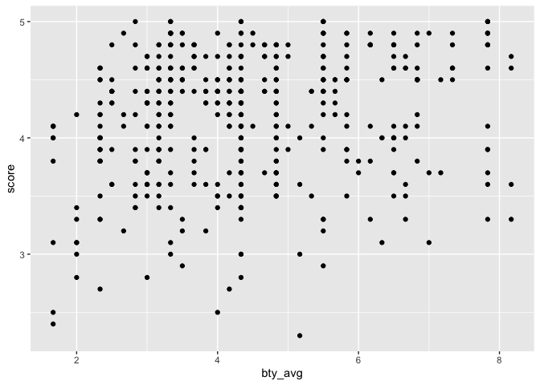

Lab 09 - Grading the professor, Pt. 1
================
Lindsay Stall
3/21/2022

### Load packages and data

``` r
library(tidyverse) 
```

    ## ── Attaching core tidyverse packages ──────────────────────── tidyverse 2.0.0 ──
    ## ✔ dplyr     1.1.0     ✔ readr     2.1.4
    ## ✔ forcats   1.0.0     ✔ stringr   1.5.0
    ## ✔ ggplot2   3.4.1     ✔ tibble    3.2.1
    ## ✔ lubridate 1.9.2     ✔ tidyr     1.3.0
    ## ✔ purrr     1.0.1     
    ## ── Conflicts ────────────────────────────────────────── tidyverse_conflicts() ──
    ## ✖ dplyr::filter() masks stats::filter()
    ## ✖ dplyr::lag()    masks stats::lag()
    ## ℹ Use the ]8;;http://conflicted.r-lib.org/conflicted package]8;; to force all conflicts to become errors

``` r
library(broom)
library(openintro)
```

    ## Loading required package: airports
    ## Loading required package: cherryblossom
    ## Loading required package: usdata

``` r
library(tidymodels)
```

    ## ── Attaching packages ────────────────────────────────────── tidymodels 1.0.0 ──
    ## ✔ dials        1.1.0     ✔ rsample      1.1.1
    ## ✔ infer        1.0.4     ✔ tune         1.0.1
    ## ✔ modeldata    1.1.0     ✔ workflows    1.1.3
    ## ✔ parsnip      1.0.4     ✔ workflowsets 1.0.0
    ## ✔ recipes      1.0.5     ✔ yardstick    1.1.0
    ## ── Conflicts ───────────────────────────────────────── tidymodels_conflicts() ──
    ## ✖ scales::discard() masks purrr::discard()
    ## ✖ dplyr::filter()   masks stats::filter()
    ## ✖ recipes::fixed()  masks stringr::fixed()
    ## ✖ dplyr::lag()      masks stats::lag()
    ## ✖ yardstick::spec() masks readr::spec()
    ## ✖ recipes::step()   masks stats::step()
    ## • Dig deeper into tidy modeling with R at https://www.tmwr.org

``` r
library(openintro)
```

``` r
library(usethis)
use_git_config(user.name = "Lindsay Stall", 
               user.email = "stallm21@wfu.edu")
```

### Exercise 1

``` r
evals %>%
  ggplot(mapping = aes(x=score)) + geom_histogram()
```

    ## `stat_bin()` using `bins = 30`. Pick better value with `binwidth`.

<!-- -->

Students rate courses generally higher so the graph is skewed. This is
not that surprising though beccause I rarely rate professors 1-2 unless
they are really bad.

### Exercise 2

``` r
evals %>%
  ggplot(mapping = aes(x=bty_avg, y=score)) + geom_point()
```

<!-- --> This doesn’t
look representative. There are less attractive professors who people
still rated high, and attractive professors that got mediocre scores.

### Exercise 3

``` r
evals %>%
  ggplot(mapping = aes(x=bty_avg, y=score)) + geom_jitter()
```

<!-- --> This adds
some variation to location of each point, so you can see points that
were on top of each other. In the other plot, the graph only shows them
each once.

### Exercise 4

``` r
m_bty <- lm(score ~ bty_avg, data=evals)
print(m_bty)
```

    ## 
    ## Call:
    ## lm(formula = score ~ bty_avg, data = evals)
    ## 
    ## Coefficients:
    ## (Intercept)      bty_avg  
    ##     3.88034      0.06664

``` r
summary(m_bty)
```

    ## 
    ## Call:
    ## lm(formula = score ~ bty_avg, data = evals)
    ## 
    ## Residuals:
    ##     Min      1Q  Median      3Q     Max 
    ## -1.9246 -0.3690  0.1420  0.3977  0.9309 
    ## 
    ## Coefficients:
    ##             Estimate Std. Error t value Pr(>|t|)    
    ## (Intercept)  3.88034    0.07614   50.96  < 2e-16 ***
    ## bty_avg      0.06664    0.01629    4.09 5.08e-05 ***
    ## ---
    ## Signif. codes:  0 '***' 0.001 '**' 0.01 '*' 0.05 '.' 0.1 ' ' 1
    ## 
    ## Residual standard error: 0.5348 on 461 degrees of freedom
    ## Multiple R-squared:  0.03502,    Adjusted R-squared:  0.03293 
    ## F-statistic: 16.73 on 1 and 461 DF,  p-value: 5.083e-05

### Exercise 5

``` r
evals %>%
  ggplot(mapping = aes(x=bty_avg, y=score)) + 
  geom_point() + geom_jitter() + geom_smooth(method = lm, color = "orange", se = FALSE)
```

    ## `geom_smooth()` using formula = 'y ~ x'

<!-- --> \### Exercise
6 The slope of the linear model is .06664, so for every point that the
attractiveness rating of the professor goes up, their score increases by
.06664.

### Exercise 7

The intercept is 3.88034, so when the attractiveness of the professor is
rated 0, their score is a 3.88034. That makes sense with this data, the
average score.

### Exercise 8

The R squared of this model is .03502, meaning that 3.5% of the variance
in score is determined by beauty rating.

### Exercise 9

``` r
m_gen <- lm(score ~ gender, data=evals)
print(m_gen)
```

    ## 
    ## Call:
    ## lm(formula = score ~ gender, data = evals)
    ## 
    ## Coefficients:
    ## (Intercept)   gendermale  
    ##      4.0928       0.1415

``` r
summary(m_gen)
```

    ## 
    ## Call:
    ## lm(formula = score ~ gender, data = evals)
    ## 
    ## Residuals:
    ##      Min       1Q   Median       3Q      Max 
    ## -1.83433 -0.36357  0.06567  0.40718  0.90718 
    ## 
    ## Coefficients:
    ##             Estimate Std. Error t value Pr(>|t|)    
    ## (Intercept)  4.09282    0.03867 105.852  < 2e-16 ***
    ## gendermale   0.14151    0.05082   2.784  0.00558 ** 
    ## ---
    ## Signif. codes:  0 '***' 0.001 '**' 0.01 '*' 0.05 '.' 0.1 ' ' 1
    ## 
    ## Residual standard error: 0.5399 on 461 degrees of freedom
    ## Multiple R-squared:  0.01654,    Adjusted R-squared:  0.01441 
    ## F-statistic: 7.753 on 1 and 461 DF,  p-value: 0.005583

### Exercise 10

for males, y = 4.09282 + (1 \* .14151) females, y = 4.09282 + (0 \*
.14151)

### Exercise 11

``` r
m_rank <- lm(score ~ rank, data=evals)
print(m_rank)
```

    ## 
    ## Call:
    ## lm(formula = score ~ rank, data = evals)
    ## 
    ## Coefficients:
    ##      (Intercept)  ranktenure track       ranktenured  
    ##           4.2843           -0.1297           -0.1452

``` r
summary(m_rank)
```

    ## 
    ## Call:
    ## lm(formula = score ~ rank, data = evals)
    ## 
    ## Residuals:
    ##     Min      1Q  Median      3Q     Max 
    ## -1.8546 -0.3391  0.1157  0.4305  0.8609 
    ## 
    ## Coefficients:
    ##                  Estimate Std. Error t value Pr(>|t|)    
    ## (Intercept)       4.28431    0.05365  79.853   <2e-16 ***
    ## ranktenure track -0.12968    0.07482  -1.733   0.0837 .  
    ## ranktenured      -0.14518    0.06355  -2.284   0.0228 *  
    ## ---
    ## Signif. codes:  0 '***' 0.001 '**' 0.01 '*' 0.05 '.' 0.1 ' ' 1
    ## 
    ## Residual standard error: 0.5419 on 460 degrees of freedom
    ## Multiple R-squared:  0.01163,    Adjusted R-squared:  0.007332 
    ## F-statistic: 2.706 on 2 and 460 DF,  p-value: 0.06786

Teaching track, y = 4.28431 - 0 Tenure track, y = 4.28431 - .1297
Tenured, y = 4.28431 - .1452

4.28431 is the professors score at level 0, teaching track -.1297 is how
much a score decreases at the tenure track -.1452 is how much the score
decreases if they are tenured

### Exerise 12

``` r
evals_rank_relevel <- evals %>%
  mutate(rank_relevel = relevel(rank, ref = "tenure track"))
```

### Exercise 13

``` r
m_rank_relevel <- lm(score ~ rank_relevel, data=evals_rank_relevel)
summary(m_rank_relevel)
```

    ## 
    ## Call:
    ## lm(formula = score ~ rank_relevel, data = evals_rank_relevel)
    ## 
    ## Residuals:
    ##     Min      1Q  Median      3Q     Max 
    ## -1.8546 -0.3391  0.1157  0.4305  0.8609 
    ## 
    ## Coefficients:
    ##                      Estimate Std. Error t value Pr(>|t|)    
    ## (Intercept)           4.15463    0.05214  79.680   <2e-16 ***
    ## rank_relevelteaching  0.12968    0.07482   1.733   0.0837 .  
    ## rank_releveltenured  -0.01550    0.06228  -0.249   0.8036    
    ## ---
    ## Signif. codes:  0 '***' 0.001 '**' 0.01 '*' 0.05 '.' 0.1 ' ' 1
    ## 
    ## Residual standard error: 0.5419 on 460 degrees of freedom
    ## Multiple R-squared:  0.01163,    Adjusted R-squared:  0.007332 
    ## F-statistic: 2.706 on 2 and 460 DF,  p-value: 0.06786

Y = 4.15463 + .12968x -.01550z 4.1563 is what a professors score will be
in the tenure track .12968 is how much a score will increase in teaching
track -.01550 is how much a score will increase when tenureed R squared
is .007332, implying that this new model explains .7% of the variance in
score

### Exercise 14

``` r
evals <- evals %>%
  mutate(tenure_eligible = recode(rank, "tenure track" = "yes", "tenured" = "yes", "teaching" = "no"))
```

### Exercise 15

``` r
m_tenure_eligible <- lm(score ~ tenure_eligible, data=evals)
summary(m_tenure_eligible)
```

    ## 
    ## Call:
    ## lm(formula = score ~ tenure_eligible, data = evals)
    ## 
    ## Residuals:
    ##     Min      1Q  Median      3Q     Max 
    ## -1.8438 -0.3438  0.1157  0.4360  0.8562 
    ## 
    ## Coefficients:
    ##                    Estimate Std. Error t value Pr(>|t|)    
    ## (Intercept)          4.2843     0.0536  79.934   <2e-16 ***
    ## tenure_eligibleyes  -0.1406     0.0607  -2.315    0.021 *  
    ## ---
    ## Signif. codes:  0 '***' 0.001 '**' 0.01 '*' 0.05 '.' 0.1 ' ' 1
    ## 
    ## Residual standard error: 0.5413 on 461 degrees of freedom
    ## Multiple R-squared:  0.0115, Adjusted R-squared:  0.009352 
    ## F-statistic: 5.361 on 1 and 461 DF,  p-value: 0.02103

y = 4.2843 - .1406x 4.2843, the score for those who are not eligible for
tenure .1406 is how much you decrease when they become eligible for
tenure R squared is .00932, which means this explains .932% of the
variation in the data
